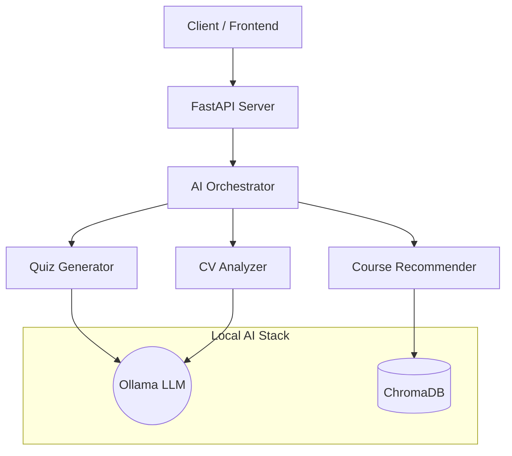

# Step 1 in AI: Microservice Implementation & Testing Guide

This document explains the AI features implemented so far in the **Smart Career AI Microservice** and provides instructions on how to run and test each component.

## 🚀 Project Status
We have successfully built a fully local, privacy-focused AI microservice using:
- **FastAPI**: For the REST API.
- **Ollama (Mistral)**: For generative AI (Quizzes, CV Analysis).
- **ChromaDB**: For Vector Search (Course Recommendations).
- **Python 3.13**: Modern async environment.

---

## 🛠️ Prerequisites

Before testing, ensure you have the following running:

1. **Activate Virtual Environment**:
   ```powershell
   .\venv\Scripts\Activate.ps1
   ```

2. **Start Ollama** (Required for AI generation):
   Open a new terminal and run:
   ```powershell
   ollama serve
   ```
   *(Ensure you have `mistral` model pulled: `ollama pull mistral`)*

---

## 🧠 Features & How to Test

### 1. AI Quiz Generator
**What it does:**  
Generates adaptive technical interview questions based on a job description and required skills. It outputs structured JSON containing questions, options, correct answers, and explanations.

**How to test (Script):**
Run the automated test script to generate a sample quiz:
```powershell
python test_quiz_gen.py
```
*Expected Output:* A list of 5 generated questions with difficulty levels and explanations.

**How to test (API):**
Endpoint: `POST /api/quiz/generate`
```json
{
  "job_description": "We need a Python Backend Developer...",
  "required_skills": ["Python", "FastAPI"],
  "candidate_level": "intermediate",
  "num_questions": 5
}
```

---

### 2. Smart CV Analyzer
**What it does:**  
Analyzes raw CV text to extract structured data:
- Technical & Soft Skills (with confidence levels).
- Experience Level (Junior/Senior/etc.).
- Total Years of Experience.
- Professional Summary.
- Match Score (if a Job Description is provided).

**How to test (Script):**
Run the analyzer on a sample "John Doe" CV:
```powershell
python test_cv_analysis.py
```
*Expected Output:* Extracted skills list, experience summary, and a match score.

**How to test (API):**
Endpoint: `POST /api/analysis/cv`
```json
{
  "cv_text": "Experienced Python Developer...",
  "job_description": "Looking for Python expert..."
}
```

---

### 3. Intelligent Course Recommendations (RAG)
**What it does:**  
Uses **ChromaDB** (Vector Database) to store course information. It performs semantic search to find courses that best match a candidate's "weak skills" or gaps found during the quiz/CV analysis.
- *Note: The database auto-seeds with sample courses (Coursera, Udemy) if empty.*

**How to test (Script):**
Run the recommendation engine test:
```powershell
python test_recs.py
```
*Expected Output:* Top courses recommended for "Python", "AWS", and "Communication".

**How to test (API):**
Endpoint: `POST /api/recommendations/courses`
```json
{
  "weak_skills": ["Python", "Communication"],
  "job_context": "Backend Development"
}
```

---

## 🌐 Running the Full Server

To invoke these features via the API (for your frontend integration), start the Uvicorn server:

```powershell
python -m uvicorn app.main:app --port 8000 --reload
```

### API Endpoints Summary:
| Feature | Method | Endpoint |
|---------|--------|----------|
| **Health Check** | `GET` | `/api/health` |
| **Generate Quiz** | `POST` | `/api/quiz/generate` |
| **Analyze CV** | `POST` | `/api/analysis/cv` |
| **Get Courses** | `POST` | `/api/recommendations/courses` |

---

## 📂 Architecture Overview


